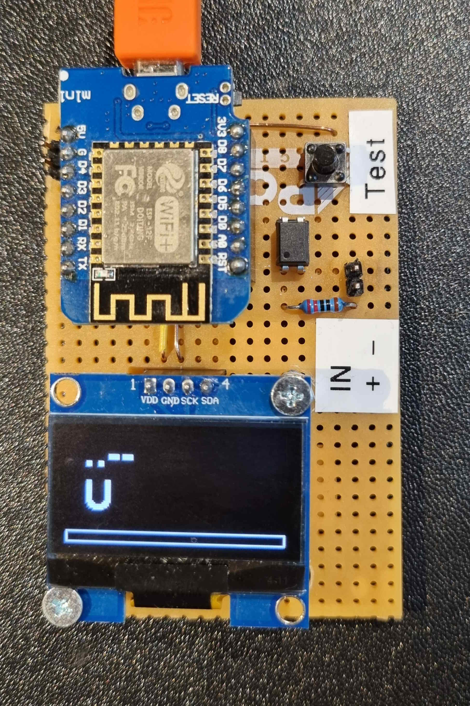
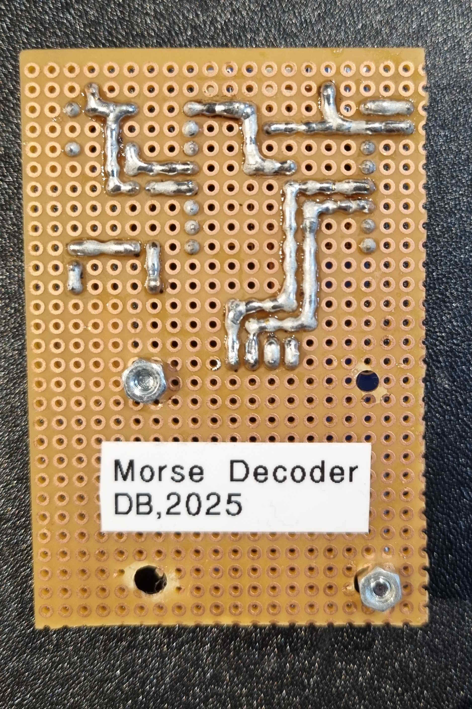
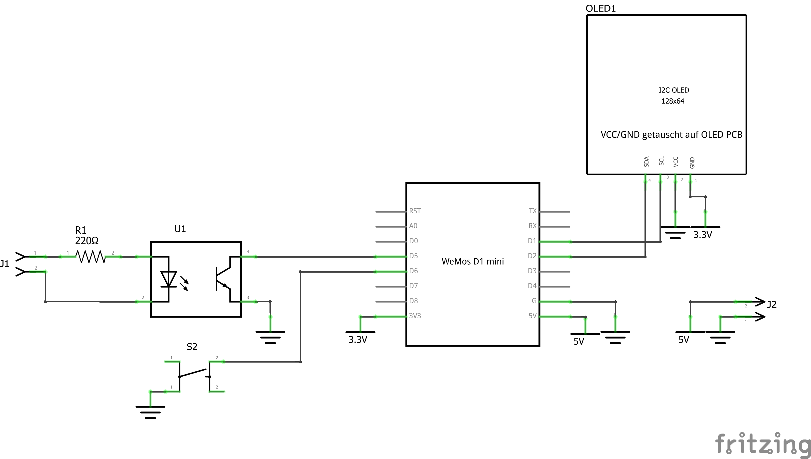
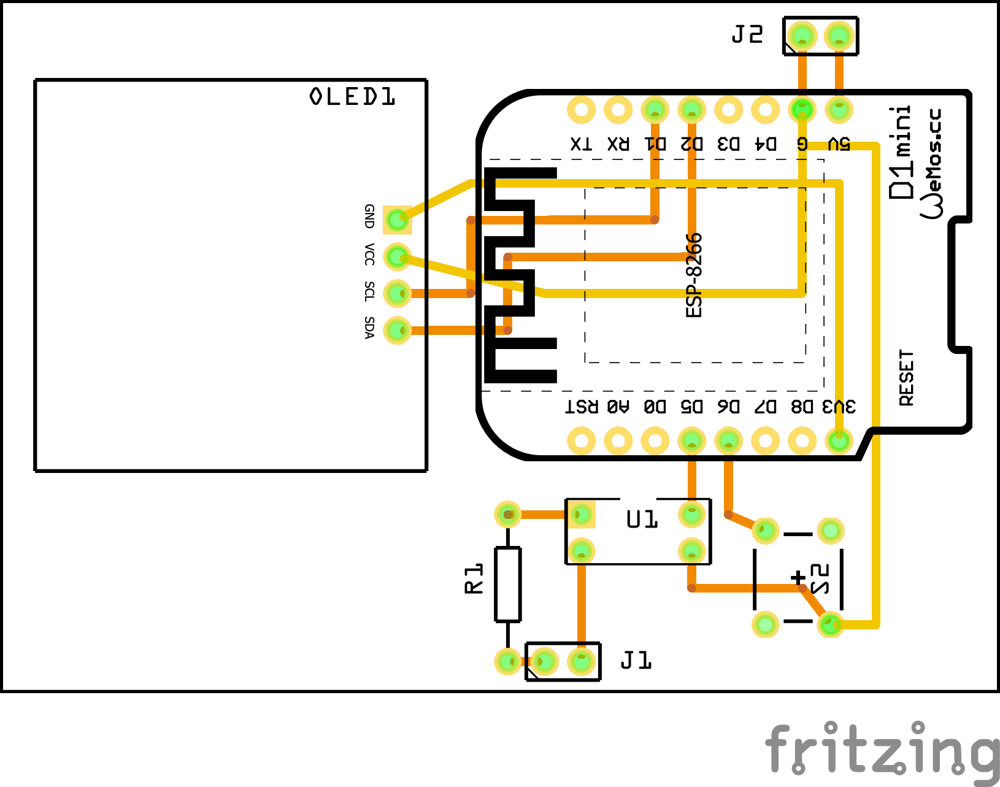

# ESP8266 Morse Decoder
A quick project for decoding morse symbols with ESP8266. Most of the code was generated by ChatGPT.

### Features
- decode morse symbols, consisting of a combination of short and long pulses
- pulses are entered via one of two GPIO pins, one pin has decoupled inputs to be used with an external power supply with a voltage of around 5V.
- decoded letters and numbers are displayed on a display, display automatically clears after a defined time
- display shows a "progress bar" which indicates, when a pulse is interpreted as a long or short pulse. The threshold value for long and short pulses can be defined in the code

### Hardware

### Software
The used libraries are linked in the code.

The display shows a custom logo in the top right corner. For creating the bytecode of this logo, the software image2cpp (https://github.com/javl/image2cpp or https://javl.github.io/image2cpp/) was used. When creating the logo, make sure to select *Swap bits in byte* in the configuration. The default logo has the size `55x16px`. When your logo has a different size, make sure to change the `logo_width` and `logo_height` defines in the code.